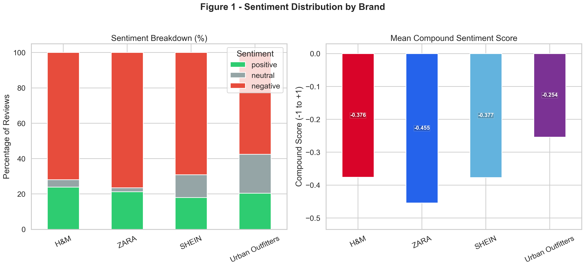
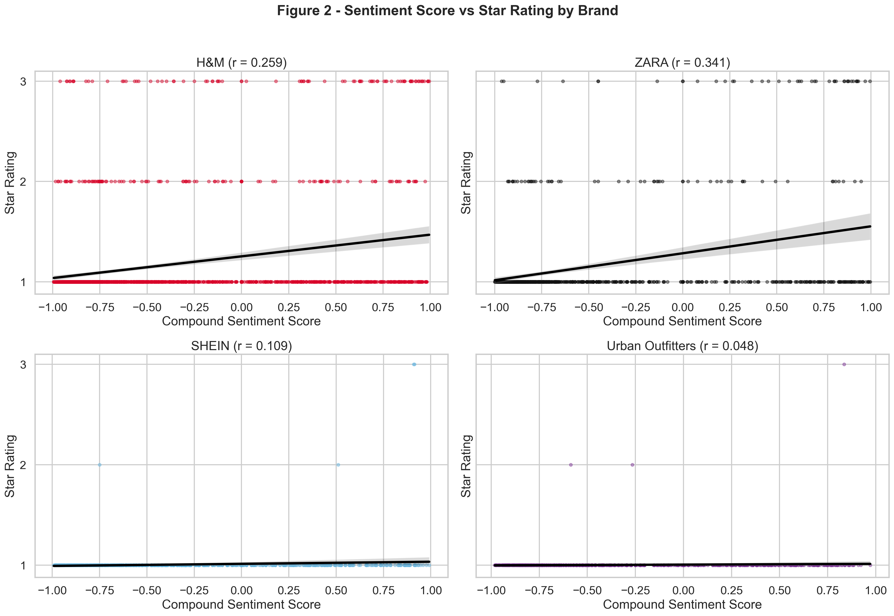
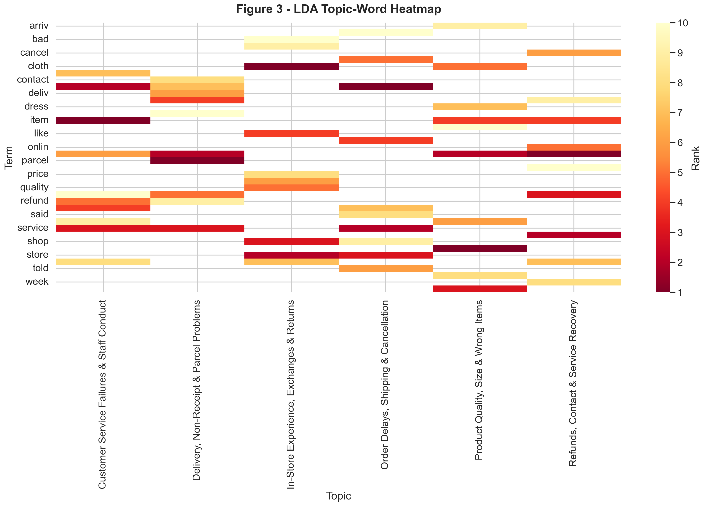
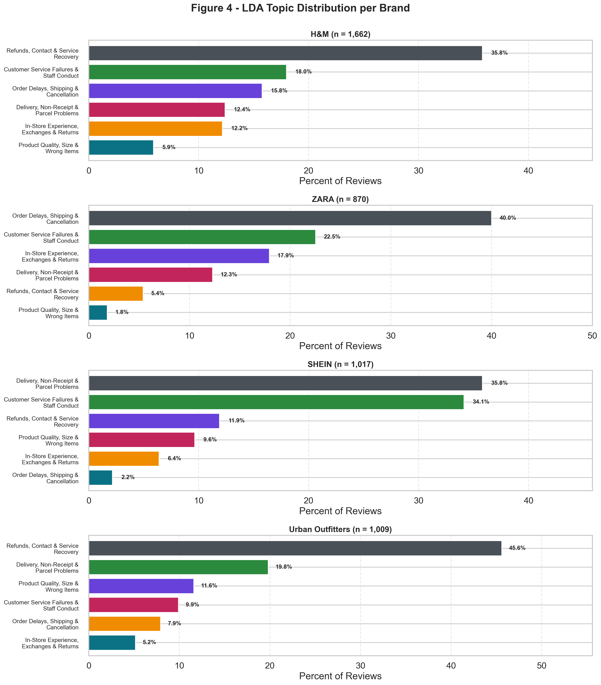
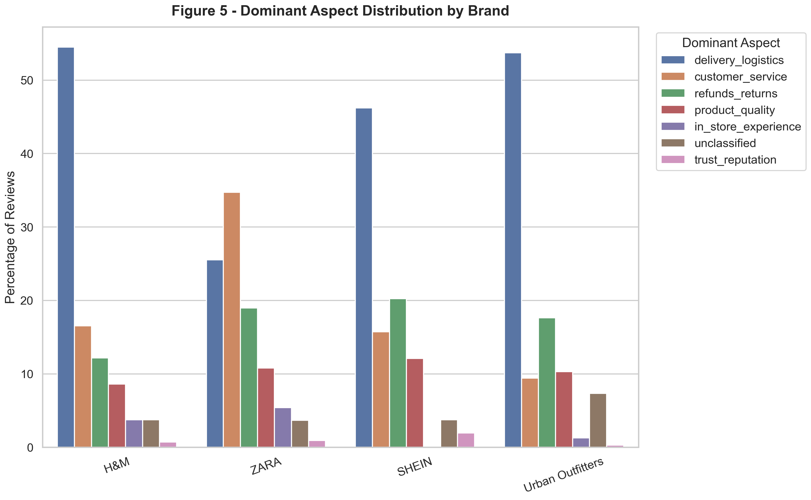
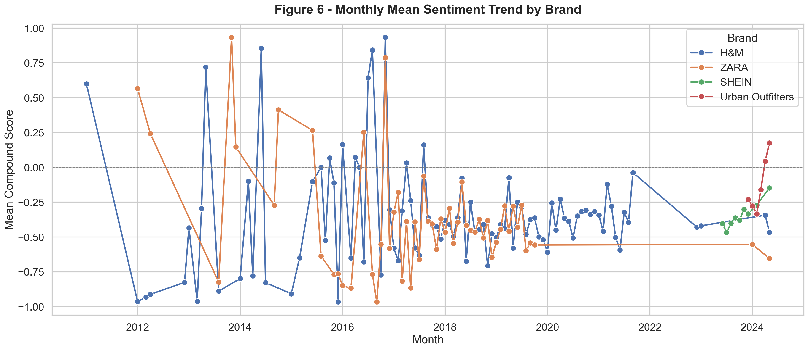
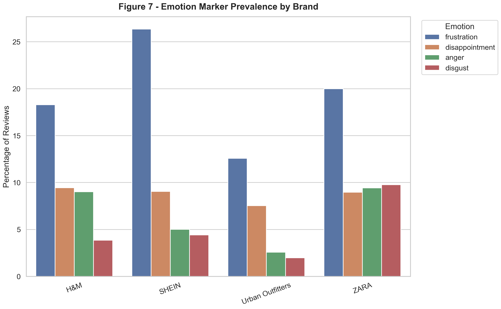
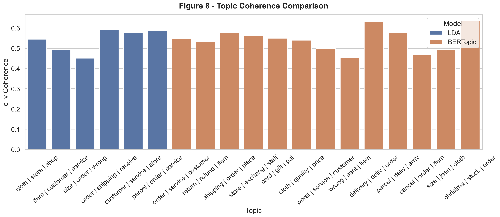

# Study 1 Manuscript Support Document

## Purpose

This document is the full narrative companion for Study 1. It is designed to be the source file for a later Word version that can be incorporated into the manuscript. It brings together the study rationale, data description, analytic strategy, key findings, and figure references in one place.

## Study Positioning

Study 1 is the exploratory stage of the broader project. It uses naturally occurring low-rated fast-fashion reviews to identify the dominant forms of low service quality, the emotional tone of complaint narratives, and the escalation patterns that later inform the confirmatory model in Study 2. In this mixed-methods design, Study 1 establishes the empirical texture of low service quality and negative engagement, while Study 2 tests the formal relationships among low service quality, negative past experience, brand hate, and brand switching.

## Data Source and Sample

The source dataset consists of 5,110 Trustpilot reviews covering H&M, ZARA, SHEIN, and Urban Outfitters. For the exploratory stage, the analysis is restricted to low-rated reviews only. Reviews were filtered to the 1-3 star range, duplicate texts were removed at the review level, and very short texts were excluded. The final analytic corpus contained 4,558 reviews.

Brand composition of the final sample:

- H&M: 1,662 reviews
- ZARA: 870 reviews
- SHEIN: 1,017 reviews
- Urban Outfitters: 1,009 reviews

The sample is intentionally skewed toward negative evaluations because the aim of Study 1 is to explore low service quality and negative engagement rather than overall brand sentiment.

## Data Preparation

The pipeline standardizes brand names, repairs common encoding artifacts, merges review titles and review bodies, parses dates into monthly periods, and derives review-level features used across the analytic workflow. These features include compound sentiment, aspect flags, emotion markers, dominant topic assignment, and brand-level aggregation outputs.

## Analytic Strategy

The Study 1 pipeline combines several transparent and reproducible techniques.

1. Descriptive profiling to summarize the filtered sample by brand, rating, review length, and time.
2. VADER sentiment analysis to estimate compound polarity and the positive, neutral, and negative score mix.
3. Dictionary-based aspect coding for delivery and logistics, refunds and returns, customer service, product quality, in-store experience, and trust/reputation.
4. Dictionary-based emotion coding for frustration, disappointment, anger, and disgust.
5. LDA topic modelling to derive the main publication-facing complaint themes.
6. BERTopic to provide a complementary robustness layer and surface narrower semantic complaint clusters.
7. Topic coherence diagnostics to compare the interpretability of the LDA and BERTopic solutions.
8. Brand-level visualizations and workbook outputs to keep the exploratory stage fully transparent.

## Descriptive Findings

The final corpus was strongly negative overall, as expected from the sampling frame. ZARA had the most negative average compound sentiment, while Urban Outfitters was comparatively less negative on average. These sentiment scores should be interpreted as differences in intensity within a low-rated review subset rather than as overall market sentiment.

Aspect coding showed that low service quality is experienced through both operational and relational failures. Delivery and logistics problems were most prominent for H&M, SHEIN, and Urban Outfitters, while customer service issues were especially prominent for ZARA. Refund and return problems were also common across all four brands, indicating that service recovery is a major part of the complaint landscape.

Emotion coding showed that frustration was the most common emotion marker across brands, followed by disappointment, anger, and disgust. ZARA showed relatively stronger anger and disgust markers, suggesting that some complaint narratives move beyond dissatisfaction toward more aversive brand responses.

## LDA Findings

The primary topic model for Study 1 is the six-topic LDA solution. After token normalization and relabeling, the six publication-facing themes are:

1. In-Store Experience, Exchanges & Returns
2. Customer Service Failures & Staff Conduct
3. Product Quality, Size & Wrong Items
4. Refunds, Contact & Service Recovery
5. Order Delays, Shipping & Cancellation
6. Delivery, Non-Receipt & Parcel Problems

These themes provide a broader and more theory-friendly overview than the narrower BERTopic clusters, which makes them better suited for the main paper narrative.

At the brand level:

- H&M is most strongly associated with Order Delays, Shipping & Cancellation.
- ZARA is most strongly associated with In-Store Experience, Exchanges & Returns and Customer Service Failures & Staff Conduct.
- SHEIN is dominated by Refunds, Contact & Service Recovery.
- Urban Outfitters is dominated by Delivery, Non-Receipt & Parcel Problems.

## BERTopic Findings

BERTopic was retained as a complementary analysis because it surfaces narrower complaint clusters that LDA intentionally smooths over. In the current workflow, BERTopic identifies semantically tighter issues such as courier-specific failures, order cancellation, wrong items, wrong sizes, gift-card disputes, and premium-delivery failures. This makes BERTopic useful for robustness checks and appendices, even though LDA remains the cleaner publication-facing summary model.

One example is the appearance of `Evri` in a BERTopic cluster. `Evri` is a UK parcel-delivery company, so that topic reflects a courier-specific delivery failure cluster rather than a theoretical construct. This is analytically useful, but it belongs more naturally in the supplementary layer than in the main thematic narrative.

## Interpretation for Study 2

Taken together, the Study 1 findings support the conceptual logic of Study 2 in three ways.

First, they show that low service quality is expressed through repeated operational and relational failures, especially in delivery, refunds, recovery, and frontline service encounters.

Second, some complaint narratives clearly reflect accumulation and repetition, which supports the inclusion of negative past experience as more than a one-off dissatisfaction response.

Third, a subset of reviews contains strong antagonistic language, frustration, disgust, and explicit rejection, which provides exploratory support for the later focus on brand hate and brand switching.

Study 1 therefore acts as the exploratory foundation for the confirmatory model in Study 2.

## Figures

### Figure 1. Sentiment Distribution by Brand

Figure 1 summarizes the sentiment composition of the low-rated review subset and compares mean compound sentiment across brands.

### Figure 2. Sentiment Score vs Star Rating by Brand

Figure 2 shows how compound sentiment varies across 1-3 star reviews within each brand.

### Figure 3. LDA Topic-Word Heatmap by Brand

Figure 3 visualizes the top topic terms by brand and helps show how complaint structures differ across retailers.

### Figure 4. Topic Distribution by Brand

Figure 4 compares the brand-level prevalence of the six LDA complaint themes.

### Figure 5. Aspect Distribution by Brand

Figure 5 shows the relative prevalence of the major aspect categories across brands.

### Figure 6. Monthly Mean Sentiment Trend by Brand

Figure 6 tracks how mean sentiment varies over time at the monthly level.

### Figure 7. Emotion Prevalence by Brand

Figure 7 compares the prevalence of frustration, disappointment, anger, and disgust markers across brands.

### Figure 8. Topic Coherence Comparison

Figure 8 compares coherence diagnostics across the LDA and BERTopic solutions.

## Supporting Files

The main analysis outputs that support this document are:

- `outputs/tables/study1_scored_reviews_public.csv`
- `outputs/tables/study1_publication_workbook.xlsx`
- `outputs/figures/study1_figures_appendix.pdf`
- `reports/draft_methodology_results.md`
- `reports/study1_results_section.md`

## Public Data and Privacy

The GitHub-facing review-level dataset is a sanitized public export. It excludes direct identity and contact columns such as reviewer names, email fields, and phone fields. Review text is also redacted for email addresses and phone numbers before export so that the public repository contains reproducible analysis outputs without exposing identifiable reviewer information.

## Remaining Steps Before Final Delivery

Before the final GitHub and Word deliverables are packaged, the remaining work is:

1. Final README polish so the repository reads well as both a publication companion and a portfolio project.
2. Git initialization and selective commit curation.
3. A data-sharing decision on whether any processed review-level outputs should be public in GitHub.
4. Creation of the final Word document version of this manuscript-support report.
5. Optional final figure caption polishing and manuscript-specific shortening.
